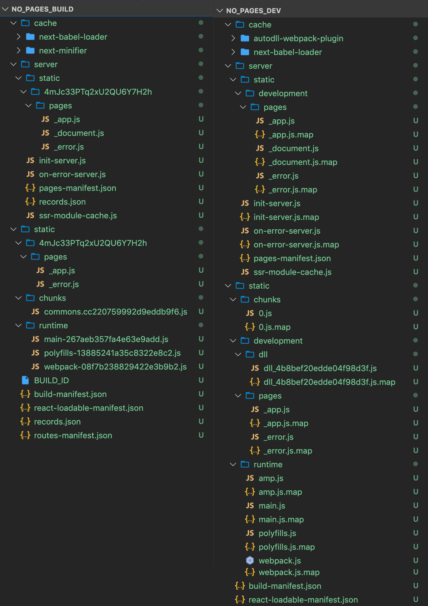
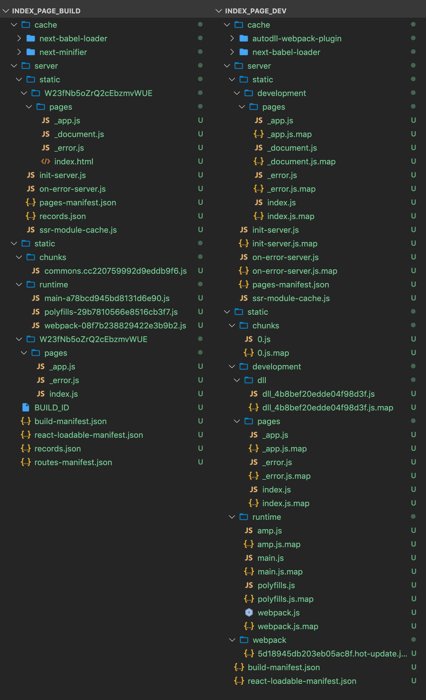
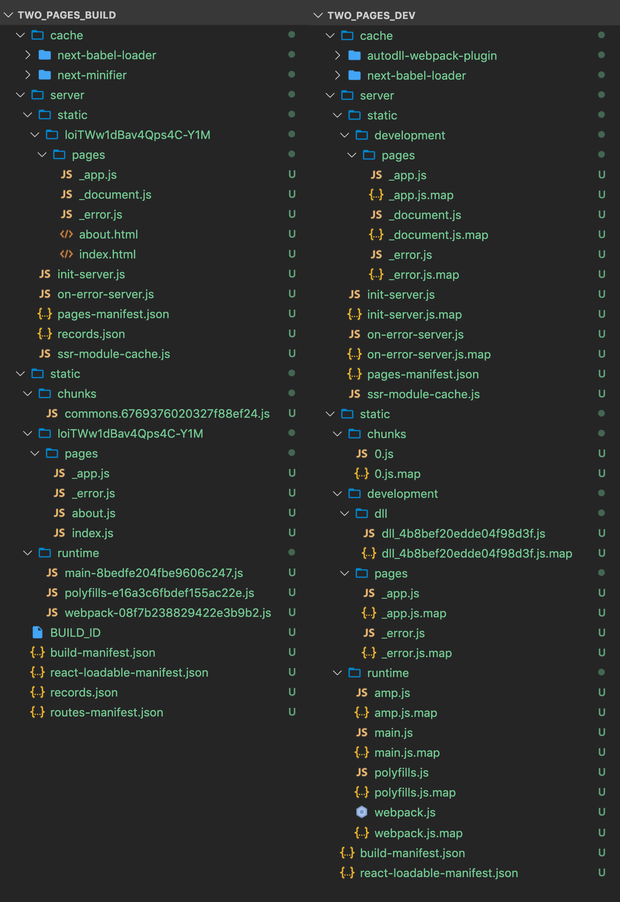

# Scratch project for Next.js

## Where do build files end up?
Vanilla configuration for Next.js v9.1.4 (no next.config.js)

- "build" is generated by `yarn build`
- "dev" is generated by `yarn dev`

### :open_file_folder: No pages

### :page_facing_up: 1 page (index.js)

### :bookmark_tabs: 2 page (index.js, about.js)

